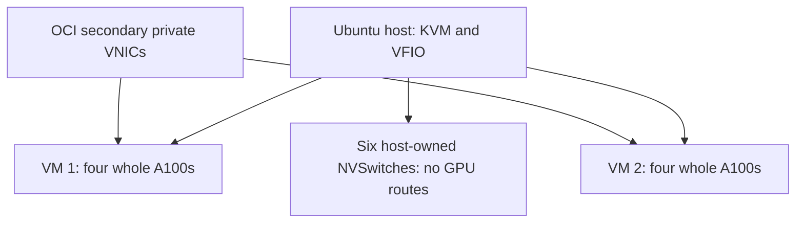

# Architecture

This design was tested on one BM.GPU4.8 host on 23 September 2026. The repository extracts that implementation into scripts driven by a reviewed configuration. See [validation](validation.md) for the scope of testing.

## Compute layout

An Ubuntu 24.04 host on OCI `BM.GPU4.8` runs KVM, QEMU and libvirt. Each of two Ubuntu guests receives four complete A100-SXM4-40GB devices through VFIO PCI passthrough, 56 pinned vCPUs, 768 GiB configured RAM and an independent 200-GiB qcow2 disk. GPU and vCPU assignments are disjoint. Each guest has four NUMA nodes with strict host memory placement.

The guests use q35, UEFI/OVMF and host CPU passthrough. A 512-GiB 64-bit PCI MMIO window accommodates device mappings; it is address space, not additional guest RAM. Ballooning is disabled. Four GPUs retain four separate GPU-memory allocations.

## GPU ownership and communication

All eight GPUs bind to stock `vfio-pci` while the guests run. All six NVSwitch devices remain on the host's NVIDIA switch driver. Before guest startup, the controller initializes Fabric Manager in mode 1, verifies inactive partitions and zero off-diagonal GPU routes, then stops Fabric Manager. Host GPU-client services remain stopped during guest ownership.

Both guests use `NVreg_NvLinkDisable=1` and the NVIDIA Data Center Driver. The accepted configuration uses whole GPUs with MIG disabled; it has no mediated vGPU devices, vGPU Manager, custom kernel/QEMU patch or reset suppression.

Direct GPU peer access was unavailable. NCCL selected `SHM/direct`, staging through CPU memory inside each guest. The tests ran separate four-GPU collectives in the two VMs; they did not establish an eight-GPU collective spanning the guests or NVLink/NVSwitch acceleration.

## Lifecycle boundaries

The lifecycle controller owns GPU binding and guest startup. It retains protected configuration backups, checks ownership before changes and stops for inspection after an uncertain transition. Normal service stop restored all eight GPUs to the host NVIDIA driver and Fabric Manager mode 0; subsequent host CUDA checks passed. The original lab also passed guest restarts and one controlled host reboot with automatic guest startup.

The oneshot service's `active/exited` state records successful startup, not continuous guest health. Configuration and initramfs backups do not provide VM-disk or application-data recovery. No fabric-service VM is created by this package.

See [networking](networking.md), [recorded validation](validation.md) and the [documentation index](README.md).
